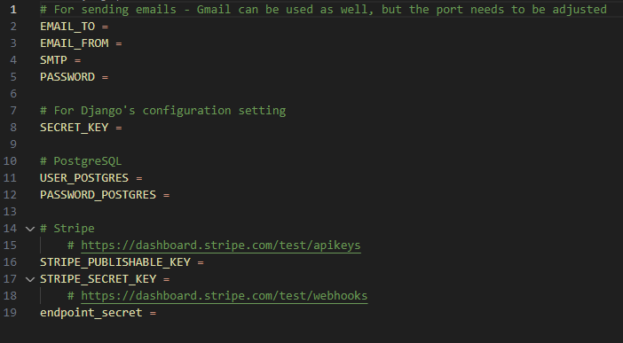

# Bookstore
**Still in progress**

This repository contains the source code for a dynamic e-commerce website built for a fictional bookstore. The project is build using Django, a Python web framework, for backend. HTML, CSS and a little bit of JavaScript for frontend.

## Table of Contents
- [Installation](#how-to-install-and-run-the-project)
- [Docker](#docker-compose)
- [Overview](#project-overview)
- [Features and Future plans](#features-and-future-plans)
- [Tools](#technologies-and-frameworks)
- [Tests](#tests)
- [Acknowledgments](#acknowledgments)
- [License](#license)

## How to install and run the project?
### Running the project locally
1. Clone the repository

` git clone https://github.com/Ewa-Anna/Bookstore `

2. Install dependencies

` pip install -r requirements.txt `

3. Change the directory

` cd bookstore `

4. Run the project

` python manage.py runserver `

Project will run on http://127.0.0.1:8000/

### Creating .env file
In order to have full experience, you need to rename your *.env.template* file to *.env* and fill all the environmental variables:
 

 
For PostgreSQL, you need to download PostgreSQL https://www.postgresql.org/download/.

For Stripe functionality, you need to create developers account on Stripe: https://dashboard.stripe.com/test/developers and download your API keys.

### GTK3 - WeasyPrint
For Windows, install GTK3, latest release:
https://github.com/tschoonj/GTK-for-Windows-Runtime-Environment-Installer/releases

For other machines, follow guidelines:
https://doc.courtbouillon.org/weasyprint/stable/first_steps.html#installation

### Running asynchronous tasks
1. RabbitMQ

`docker pull rabbitmq`

`docker run -it --rm --name rabbitmq -p 5672:5672 -p 15672:15672 rabbitmq:management`

RabbitMQ will run on http://127.0.0.1:15672/

2. Celery worker thread

`celery -A bookstore worker -l info -P gevent`

3. Flower

`celery -A bookstore flower`

Flower will run on http://localhost:5555/dashboard/

## docker-compose
Building Docker Image
 
` docker-compose build `
 
Running Docker Container
 
` docker-compose up -d `

## Project overview

The Bookstore is a web-based application developed using Python (Django) for backend and HTML (jinja2), CSS (bootstrap), and JavaScript for frontend to create a user-friendly and feature-rich online bookstore. 
 
PostgreSQL is used as the primary database to store core data, such as books, user profiles, and orders and manages critical data. Additionally, Redis is utilized for enhancing user experience through personalized book recommendations tailored to individual interests.
 
Its primary purpose is to serve as an online bookstore, offering a range of core functionalities. Inter alia: book catalog with pagination system, book details with possibility to post a review and rate a book. Tagging system and categories. Latest arrivals and recommended similar books. Search, filtering and sorting functionality. Adding to cart and to wishlist. Making order and paying (with Stripe). User profile with basic info, list of orders and shipping addresses (main and additional).

## Features and Future plans
1. :heavy_check_mark: **Book Catalog**: Users can view a list of available books for purchase. Each book is presented with basic information. Users can click on individual books to access detailed information about them, such as the book's description, author, price, and reviews from other users. 
2. :heavy_check_mark: **User Reviews**: Registered users can post reviews and ratings for books they have read. These reviews help other users make informed decisions about their purchases. 
3. :heavy_check_mark: **Search**: User can perform simple search. 
4. :heavy_check_mark: **Tag System**: The project includes a tagging system that allows books to be categorized based on tags. Users can search for books with similar tags, enhancing their browsing experience. 
5. :heavy_check_mark: **User Profile**: User can now access basic profile with option to edit their data. 
6. :heavy_check_mark: **Cart**: Users can add books to their shopping cart while browsing the catalog. The cart displays the selected books, their quantities, and the total cost. Users can review and modify their cart contents before proceeding to checkout. 
7. :heavy_check_mark: **Order Summary**: A summary of the order is displayed, showing the total cost, quantity and price of the books. Users can review the order details one last time before confirming the purchase. 
8. **Advanced Search**: Implement an advanced search feature that allows users to filter books by various criteria such as genre, price range, author, and publication date.
9. :heavy_check_mark: **Order Confirmation**: Once the user clicks "Submit order" the system processes the transaction, verifies payment information, and generates an order confirmation. Users receive an email confirmation with details of their purchase.
10.	:heavy_check_mark: **Advanced User Profiles**: User authentication functionality is implemented, enabling users to create accounts and maintain profiles. In their profiles, users can view their order history and other account-related information.
11.	**Wishlist**: Enable users to create a wishlist where they can save books they intend to purchase later.
11. **Quick Actions**: Enable users to add items to their wishlist or cart by clicking the icon above the book's photo.
12.	:heavy_check_mark: **Book Ratings**: Allow users to rate books on a scale and provide detailed feedback. Display average ratings.
12. **Sorting functionality**: Enable users to sort reviews by rating or date.
13.	**Social Media Sharing**: Implement social sharing buttons to encourage users to share their favorite books, reviews, and recommendations on social media platforms.
14.	**Discounts and Promotions**: Run promotional campaigns, offer discounts, and provide coupon codes during special events or holidays to attract more users and boost sales.
15.	**Multi-Language Support**: Enable users to access the website in their preferred language. Implement a language selection feature and provide translations for book details and user interface elements.
16.	**Author Pages**: Create dedicated pages for authors, showcasing their biography, other works, and a list of books authored by them. Users can explore books by their favorite authors.
17.	**Book Bundles**: Offer book bundles or sets at discounted prices, encouraging users to purchase multiple related books together.
18.	**Book Availability Notification**: Allow users to subscribe to notifications for out-of-stock books. When a book becomes available, users receive an alert to purchase it.
19.	**Recommendation Engine**: Enhance the book recommendation system by incorporating machine learning algorithms. Provide personalized book suggestions based on users' reading history, preferences, and ratings.
20. **Dark Mode**: Implement a dark mode option for users who prefer a darker interface.
21. **Tests**: Unit, functional, performance, integration, authentication and authorization.
22. **Order Split**: Calculate the weight of books in order, in case it is more than 20kg, split it into smaller ones.
23. **Small Bot**: Small bot chat, that would allow users to ask simple questions about the website and get answers.

## Technologies and frameworks
- Backend
    
     
    

- Frontend
    
    
     
    

- Databases

    
    

- Other

    
    
    

## Tests
Run all tests
 
`python manage.py test tests`
 
`pytest`

## Acknowledgments
- Django 4 By Example [*Antonio Melé*](https://antoniomele.es/) [Packt>](https://www.packtpub.com/)

## License
Distributed under the MIT License. See [LICENSE](LICENSE) for more information.